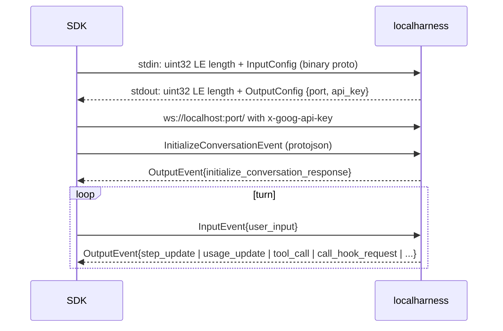

# Antigravity CLI Provider

Implements `genai.Provider` backed by the Google Antigravity CLI (`agy`). The package documentation in
`client.go` describes the protocol, sessions, and side effects; `dto.go` documents the wire types.

## Install

```sh
curl -fsSL https://antigravity.google/cli/install.sh | bash
agy  # sign in once interactively
```

The installer appends `~/.local/bin` to `PATH` in `~/.bashrc` and `~/.profile`. `agy` self-updates in the
background.

## References

- `agy changelog`: release notes, including print-mode and stream-json changes.
- https://github.com/google-antigravity/antigravity-sdk-python at v0.1.21, commit
  `f61cb2fa54a0a3c46dac690f32e4346995662297`: `google/antigravity/proto/localharness.proto` declares the
  messages that agy's stdout events project.

## Keeping DTOs in sync

`dto.go` matches agy 1.3.2. To check a new release:

1. Read `agy changelog` for print-mode and stream-json entries.
2. Dump the upstream structs and compare them with `dto.go`:
   `go run ./providers/antigravity/internal/extracttypes ~/.local/bin/agy`. Stdout events live in package
   `steps`, stdin messages in `printmode`. The tool supports Go 1.27 layouts only; update its size constants
   when agy moves to a toolchain that changes `internal/abi`.
3. Diff `localharness.proto` in the SDK against the pinned commit.
4. Record fresh fixtures with `RECORD=failure_only go test ./providers/antigravity/`. `TestStreamEvent`
   decodes every fixture line with unknown fields disallowed.

Enum values (`state`, `step_type`, `status`) are untyped strings upstream; the type descriptors do not list
them.

## localharness alternative

The SDK does not run agy. Its wheel bundles a separate Go binary, `localharness`, that authenticates with
`GEMINI_API_KEY` or Vertex AI instead of the agy subscription:



A provider driving it would support a system prompt, custom tools, a response schema, thinking deltas, and
policies that disable built-in tools, with DTOs generated from the protos. Costs: API key billing,
extracting the binary from the PyPI wheel, and a WebSocket transport that `subprocessrecord` does not record.

## Open questions

- Effect of `GEMINI_API_KEY` on agy: with a signed-in session, `/usage` reports the same subscription quota
  with and without the variable set.
